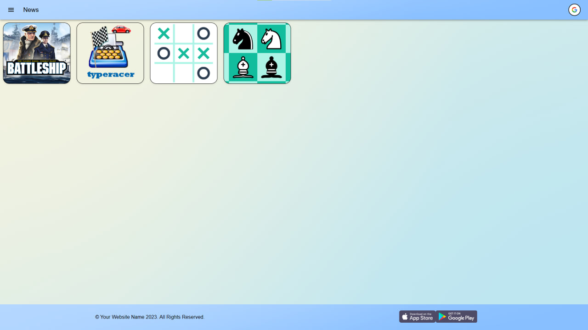
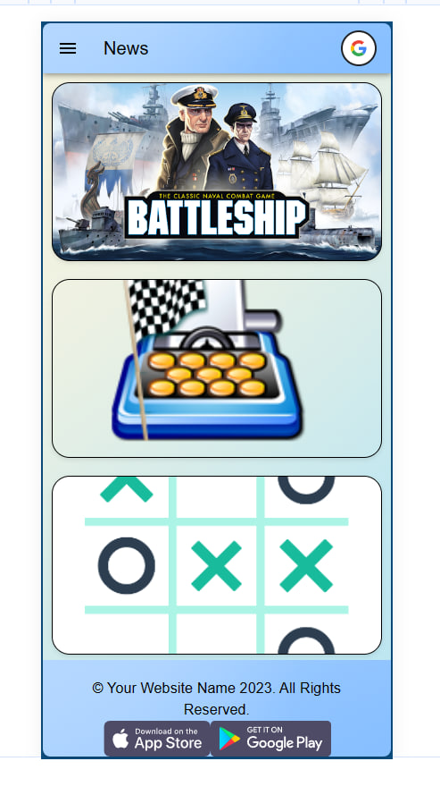

# James Games Website



Explore a collection of games implemented using React.js, TypeScript, Vite, and Material-UI.

---

## Live Demo

You can play the Battleship game live at [james-games.netlify.app](https://james-games.netlify.app/). Enjoy the game and feel free to provide feedback!

---

## Mobile Friendly

Our games are designed to be mobile-friendly and provide a great user experience on both desktop and mobile devices. Here's a screenshot of our games running on a mobile device:

<p align="center">
  
</p>

The responsive design ensures that the games adapt to the screen size of the device they're being played on, providing an optimal layout whether you're playing on a desktop, a tablet, or a mobile phone.

## Table of Contents

- [Getting Started](#getting-started)
  - [Prerequisites](#prerequisites)
  - [Installation](#installation)
  - [Available Scripts](#available-scripts)
- [Project Structure](#project-structure)
- [Game Rules](#game-rules)
- [Technologies Used](#technologies-used)
- [Contributing](#contributing)
- [License](#license)

## Getting Started

### Prerequisites

- [Node.js](https://nodejs.org/) (v14 or later)
- [npm](https://www.npmjs.com/) or [Yarn](https://yarnpkg.com/)

### Installation

1. Clone the repository:

   ```bash
   git clone https://github.com/your-username/games-website.git
   ```

2. Navigate to the project directory:

   ```bash
   cd client
   ```

3. Install dependencies:

   ```bash
   npm install
   # or
   yarn
   ```

### Available Scripts

- `npm start` or `yarn start`: Runs the app in development mode.
- `npm run build` or `yarn build`: Builds the app for production.
- `npm run serve` or `yarn serve`: Serves the production build for testing.

## Project Structure

- `src/`: Contains the source code of the application.
  - `assets`: Image icons.
  - `pages/`: Application pages.
  - `utils/`: Utility functions.
    - `styles/`: CSS or styling files.
- `public/`: Public assets and the `index.html` file.
- `vite.config.ts`: Configuration file for Vite.
- `tsconfig.json`: TypeScript configuration file.

## Game Rules

- Each game follows its own unique set of rules.
- Dive into the documentation of each game to learn how to play and enjoy the experience.

## Technologies Used

- [React.js](https://reactjs.org/): JavaScript library for building user interfaces.
- [Vite](https://vitejs.dev/): Fast, opinionated web dev build tool.
- [TypeScript](https://www.typescriptlang.org/): Superset of JavaScript with static types.
- [Material-UI](https://material-ui.com/): React components that implement Google's Material Design.

## Contributing

Feel free to contribute to this project. You can open issues or submit pull requests.

## License

This project is licensed under the MIT License - see the [LICENSE](LICENSE) file for details.
